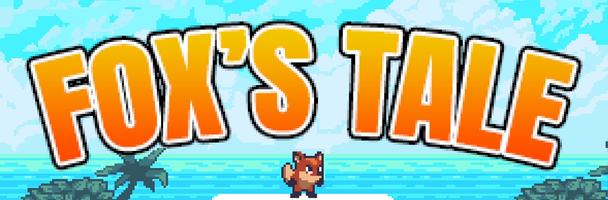
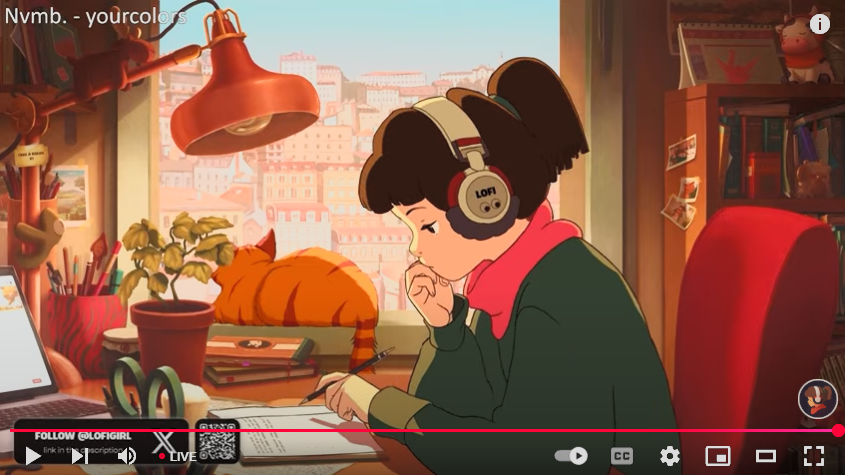

FOX'S TALE is a game that it's playing metod is similar to the classic game "Mario Run". Player can control the character to move forward and backward.Furthermore, the character can single jump and double jump. During the game, player can collect the coins in order to achieve a better score and avoid danger in order to keep the statement of character remain healthy.At the main page of the game contains an ranking of score.

## Table of content

- [Quick Started](#quick-started)
- [Purpose of Our Game](#purpose)
- [Team Members](#members)
- [Schedule](#schedule)
- [Development Process](#development-process)
- [Current Status](#current-status)
- [Future Plan](#future-plan)

## Quick Started

### Demo Video

Our game is available in page [release build](https://github.com/COMP2116-Ma-Mario-Game-Game/FoxsTale/releases/tag/beta.2), download it and give it a try!

### Minimum Requirements

- OS: Windows 10 64-bit or newer
- CPU: Intel Core i5-9700 / AMD Ryzen 5 5500
- Memory: 16GB RAM
- GPU: NVIDIA GeForce GTX 1060 / AMD Radeon RX 5600 / INTEL Arc A750
- DirectX: Version 12
- Storage: 128MB available space

## Purposes of Our Game

Our target audiences are mainly for primary and secondary school children to have an positve game to enjoy, but it is also suitable for any age of user to play our game. For the development, we chose the Agile Development Process. The reason for this choice is because the game market is highly competitive and we would like to adopt the Time-To-Market strategy. The Agile Development Process is a good fit for our strategy. We have concluded that we're able to complete this goal under some deep thinking of condition such as possibility, difficulty, work time period etc.

## Team Members

Our team consists of the following members:

| Name | Student ID | Role | Responsiblities | Portion |
| --- | :---: | --- | --- | :---: |
| Michale Leong | P2304152 | Programmer, Docs Clerk  | Prototype, Main Game, Docs | 0.2 |
| Henry Chou | P2304111 | Docs Clerk | Docs | 0.2 |
| Bibie Chen | P2321060 | Game Designer, Programmer, Docs Clerk | Prototype, Main Game, Docs | 0.2 |
| Thomas Cheang | P2321902 | Docs Clerk, Video Editor | Docs, Demo | 0.2 |
| Todd Huang | P2304318 | Programmer, Docs Clerk | Prototype, Docs | 0.2 |

## Schedule

Below is the planned schedule of the game development up to the first release. It is divided into three phases:

- Exploration (Feb 20 - Mar 11, 2025 / 3 weeks)

    In this phrase, we brainstormed the theme and the potential features of our game. Additionally, we built a simple demo to showcase the feasiblity.

- Iterations (Mar 24 - Apr 13, 2025 / 3 weeks)

    In this phase, the development process formally started. We carried out our development with weekly iterations.

- Pre-release (Apr 14 - Apr 22, 2025 / ~1 week)

    In this phase, we had the game ready for its first release. Besdies, we finalized the front page of our repository.

## Development Process

### Meeting Minutes

- [#29 1st group meeting discussion](https://github.com/COMP2116-Ma-Mario-Game-Game/FoxsTale/issues/29)
- [#30 2nd group meeting discussion](https://github.com/COMP2116-Ma-Mario-Game-Game/FoxsTale/issues/30)
- [#31 3rd group meeting discussion](https://github.com/COMP2116-Ma-Mario-Game-Game/FoxsTale/issues/31)

### Tasks

We use GitHub Issues to manage our tasks for the aigle development process, and here are the [rules](https://github.com/COMP2116-Ma-Mario-Game-Game/FoxsTale/issues/3) we follow. For a complete list of tasks, please visit [here](https://github.com/COMP2116-Ma-Mario-Game-Game/FoxsTale/issues?q=is%3Aissue%20type%3ATask%20).

### Iterations & Pre-release

- Iteration 0 (Mar 4 - 10, 2025 / 1 week)

    Planned Tasks:
    1. Complete the basic framework of the game.
    2. Create a tile palette and draw a level with tilemaps.

    Completed Tasks:
    1. Complete the basic framework of the game.
    2. Create a tile palette and draw a level with tilemaps.

- Iteration 1 (Mar 24 - 30 / 1 week)

    Planned Tasks:
    1. Create the basic model and animation of the protagonist Fox.
    2. Create a health system and sut up health UI
    3. Create and integrate the first enemy
    4. Create the back-end of the ranking of the game

    Completed Tasks:
    1. Create the basic model and animation of the protagonist Fox.
    2. Create a health system and sut up health UI
    3. Create and integrate the first enemy
    4. Create the back-end of the ranking of the game

- Iteration 2 (Mar 31 - Apr 6 / 1 week)

    Planned Tasks:
    1. Create a collective system and sut up collective UI
    2. Create the basic model and animation of the Gems(collective things).
    3. Add pickup effect
    4. Add sound effect
    5. Create the front-end of the ranking of the game

    Completed Tasks:
    1. Create a collective system and sut up collective UI
    2. Create the basic model and animation of the Gems(collective things).
    3. Add pickup effect
    4. Create the front-end of the ranking of the game

- Iteration 3 (Apr 7 - Apr 13 / 1 week)

    Planned Tasks:
    1. Add sound effect
    2. Make the Menu work
    3. Create the score system and timing system
    4. implement the score system into the ranking system

    Completed Tasks:
    1. Add sound effect
    2. Make the Menu work
    3. Create the score system and timing system
    4. implement the score system into the ranking system

- Pre-release (Apr 14 - Apr 22 / ~1 week)

    Planned Tasks:
    1. Conduct final game testing and debugging and prepare for release.
    2. Polish the README.md.

    Completed Tasks:
    1. Conduct final game testing and debugging and prepare for release.
    2. Polish the README.md.

### Toolset

- Programming Language: C#, Python, ...
- Frameworks: Django, ...
- IDEs: Unity 6000.0, VS Code, ...
- Version Control: Git, GitHub
- Hosting Platform: PythonAnywhere
- ...

### Algorithm

In this game, we have use the following algorithm ...

### Open Source Notice

In this game, we have used the following open source packages:
- [Newtonsoft Json Unity Package](https://docs.unity3d.com/Packages/com.unity.nuget.newtonsoft-json@3.2)

## Current status

Currently, our game has one level only. In addition, our game contain the timting system, score system and ranking system. The timing system may add extra points to the score system meanwhile the ranking system is depend by the score system.

## Future Plan

This section outlines the elements of our game that how it might be developed in future:

- More levels: the difficulty will increase as player enter to the next level.
- Game tutorial: insert a beginner tutorial at the very first stage to teach player hoe to play.
- Multi-player system: except the solo mode, it could be developed a multi-players mode for new game experience.
- Different character: new character could be invented whuch might bring with variety extra ability.
- New character's skin: character's skin system might be developed in order to improve attract of player on the game.
- Shopping system: A shopping system could be develpoed to let player to spend the coins they have got in the game and buy new character, skin or item if any.
- Invent item: item may give character different effect.
- Buff and debuff system: During the game, there might exist some blocks or items that may affect character's status such as speeding, blindness, slowing, hopping, rushing, frozing, posion etc.
